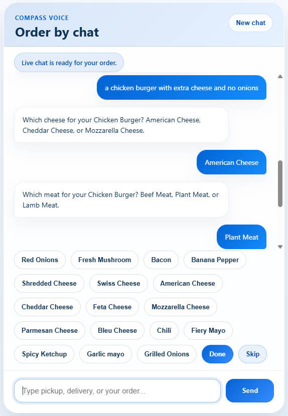

# Compass Voice

Production-grade AI voice ordering for restaurants, built around deterministic flow control instead of LLM-led orchestration.

## Overview

Compass Voice handles restaurant ordering conversations over phone calls and a browser demo interface. The system is designed for reliability under real-time telephony constraints:

- Twilio voice webhook + media stream ingestion
- Deepgram streaming speech-to-text and text-to-speech
- Deterministic state machine routing
- NLU-backed intent and slot extraction
- Cart, checkout, SMS, and payment-link flows
- Real-time latency and NLU logging

This repo is not a generic chatbot wrapper. The LLM/NLU layer is used for understanding, while control flow stays inside explicit state and handler logic.

## Demo

The repository includes a browser chat demo that exercises the same turn engine used by the voice flow.



- Browser UI: `/ui`
- Test chat API: `POST /test/chat`
- Voice webhook: `POST /voice`
- Twilio media websocket: `/ws/twilio-media`

## Architecture

High-level request path:

```text
Caller / Browser UI
    -> API layer
    -> Turn engine
    -> NLU + slot extraction
    -> Deterministic state router
    -> State-specific handlers
    -> Response builder
    -> TTS / UI response
```

Primary components:

- `app/api/voice_stream_server.py`: FastAPI app, Twilio voice webhook, media websocket, static mounts, and runtime wiring
- `app/api/chat_demo.py`: browser chat endpoint for testing the conversation engine without a phone call
- `app/core/turn_engine.py`: orchestration for transcript -> intent/slots -> routing -> response
- `app/state_machine/`: deterministic flow sets, router, conversation models, and handlers
- `app/ml/`: intent and slot inference assets
- `app/services/`: SMS, checkout, live-call, and payment-related integrations
- `app/menu/` and `app/data/restaurants/demo/`: menu and restaurant data used at runtime
- `app/logging/`: latency and NLU CSV logging

## Key Design Choices

- Deterministic state machine controls every transition
- Response building is centralized to keep phrasing predictable
- Telephony audio is handled in Twilio-compatible mu-law 8kHz frames
- Streaming-first design reduces latency for both STT and TTS
- Payment and checkout status are modeled as explicit waiting states, not inferred conversationally

## Project Layout

```text
compass-voice/
|- app/
|  |- api/
|  |- bootstrap/
|  |- cart/
|  |- core/
|  |- data/
|  |- logging/
|  |- menu/
|  |- ml/
|  |- realtime/
|  |- responses/
|  |- services/
|  |- session/
|  |- state_machine/
|  |- static/
|  `- utils/
|- tests/
|- Dockerfile
|- docker-compose.yaml
`- README.md
```

## Running Locally

### Prerequisites

- Python 3.12
- Redis
- Twilio account
- Deepgram API key

### Required environment

Set these before starting the app locally or through Docker:

```bash
DEEPGRAM_API_KEY=your_deepgram_key
TWILIO_ACCOUNT_SID=your_twilio_sid
TWILIO_AUTH_TOKEN=your_twilio_auth_token
REDIS_HOST=localhost
REDIS_PORT=6379
PUBLIC_WSS_BASE_URL=wss://your-public-host
```

Common optional runtime settings:

```bash
DEEPGRAM_TTS_MODEL=aura-2-thalia-en
COMPASS_REALTIME_LATENCY_LOG_PATH=./runtime-logs/realtime_turn_latency.jsonl
COMPASS_REALTIME_LATENCY_CSV_PATH=./runtime-logs/realtime_turn_latency.csv
COMPASS_NLU_CSV_LOG_DIR=./runtime-logs/nlu
```

### Start with Docker Compose

```bash
docker compose up --build
```

The included compose file starts:

- `voice-stream` on port `8000`
- `redis` on port `6379`

### Start manually

```bash
pip install -r requirements.txt
uvicorn app.api.voice_stream_server:app --host 0.0.0.0 --port 8000 --reload
```

If Twilio needs to reach your machine, expose the app with a public tunnel such as ngrok or a deployed host.

## Testing

Run the automated test suite with:

```bash
pytest
```

The `tests/` directory covers the turn engine, cart logic, menu resolution, state machine handlers, API behavior, and services.

## Notes

- Runtime bootstrap loads restaurant data from `app/data/restaurants/demo/` by default.
- The browser demo is useful for validating flows before wiring Twilio.
- Logs and CSV traces are intended to help with latency tuning and NLU debugging in production-like runs.
